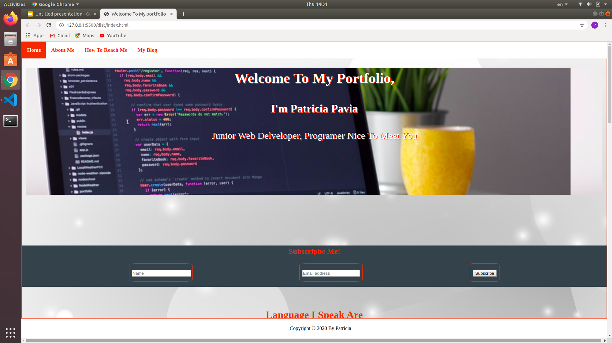
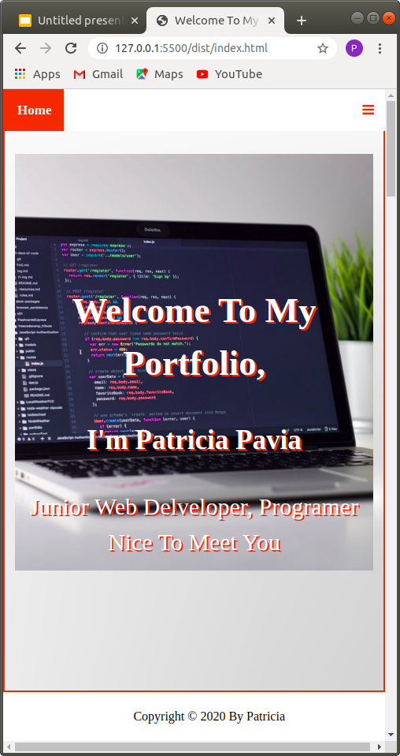
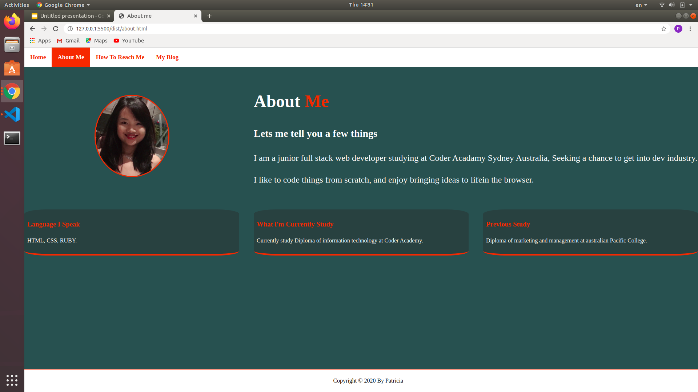
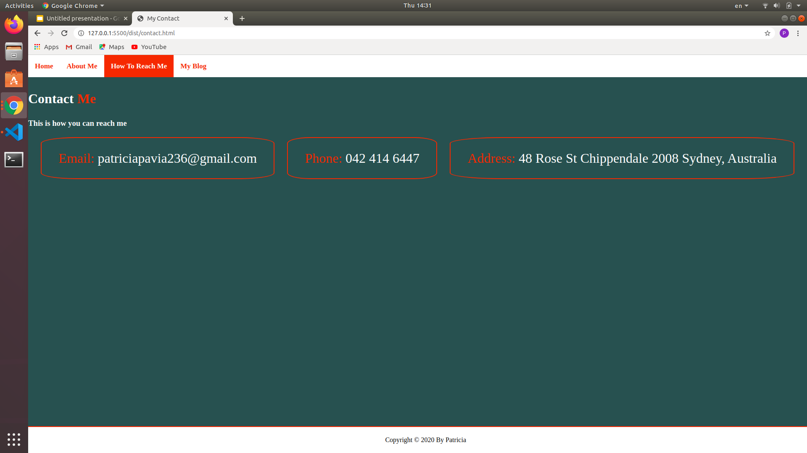
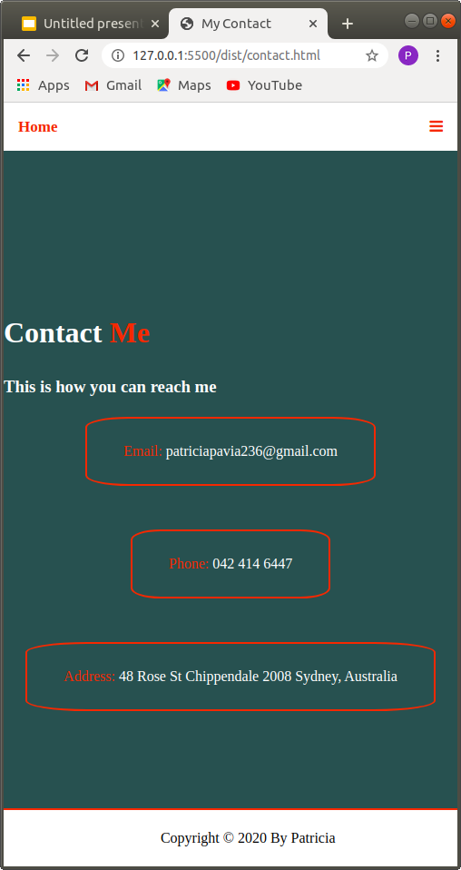
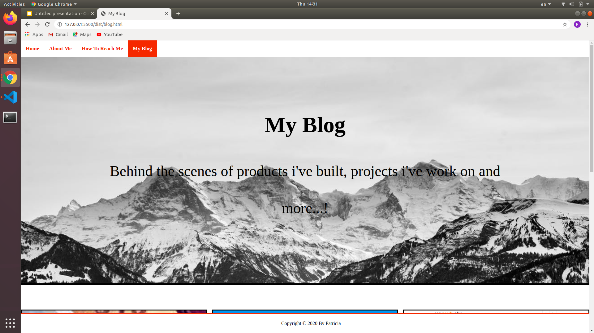

# Patricia Pavia Porfolio Website -T1A3

Website:https://patriciapavia.github.io/portfolio-website/

github:https://github.com/Patriciapavia/portfolio-website

# purpose

The purpose of this website is to present myskill, and work for fulture employment potental.

# Functionality and Feature

##component1 Navigation Bar and Footer Bar
all the site will include navigation bar which will link to all page across the website, while user using curren site navigation ba will change color to make that site bright so user know which site they are using.

its Fully responsive website if on mobile screen navigation bar will disappear and show bar i con on the right coner.

footer is a fixed position which has copy right, year and author name.

# Bannner

website has 4 separate file which include html, *index.html is the home page which has 5 section, each section display nicely with grid colume, and has a social icon which link to social website by clicking it.
*about.html is to introduce my self is include my image, and education.
*contact is my contact detail which include email,phone number, address.
*blog is a blog post which include several page image access the post by cliking it.

# Semantic HTML
HTML element has been use as appropriate purpose such as Navbar,heading, section, div to make it display better in the brownser.

# Responsive design

all flex box and grid has been use to display website as responsive as possibe, using @media screen to define a display site that suitable for mobile device and small screen.

# Target audience
* Employer
* project manager
* freelancing
# Sitemap

# Teach Stack
* HTML is used for all text and content in every page.
*CSS is use to style all element to display as a professtional website
*javasript is use for navbar responsive for mobile
*packet.jason is use to deploy and sript a file

#screen Shot
## homepage desktop and mobile

## about page desktop and mobile site

## contact desktop and mobile site

## Blog desktop and mobile site

